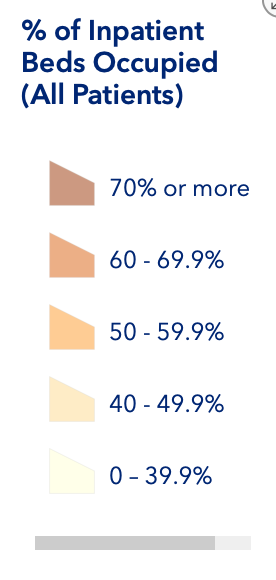

```{r setup, include=FALSE}
knitr::opts_chunk$set(echo = TRUE)
library(ggplot2)
library(usmap)

# https://github.com/r-lib/hugodown/

df = read.csv("COVID-19_Reported_Patient_Impact_and_Hospital_Capacity_by_State.csv")
df = df[c("state", "inpatient_beds_utilization")]
```

## Intro

Curious to see hospital bed utilization, a search brought
me to the [HHS Inpatient Dashboard](https://protect-public.hhs.gov/pages/hospital-utilization).


The amount of dark brown (70%+) is shocking.

This brought up two questions:

1. What is the historical rate of usage / occupancy?
2. How did they choose the scale used to color the graph?


## Historical Usage

[Occupancy rate data from the CDC](https://www.cdc.gov/nchs/data/hus/2017/089.pdf)
shows that the long-term average occupancy rate, 
ignoring the oldest years of 1975 and 1980,
is in the **mid to high sixties.**

| Year | Occupancy Rate |
|------|-------|
| 1975 | 76.7% |
| 1980 | 77.7% |
| 1990 | 69.5% |
| 2000 | 66.1% |
| 2005 | 69.3% |
| 2010 | 66.6% |
| 2013 | 64.7% |
| 2014 | 64.8% |
| 2015 | 65.5% |

[Statistica data](https://www.statista.com/statistics/185904/hospital-occupancy-rate-in-the-us-since-2001/)
shows a few more years, with a similar range on the occupancy rate.

**The mean from 2008-2017 was `r mean(c(68.2, 67.8, 66.6, 66.5, 65.2, 64.7, 64.8, 65.5, 65.8, 65.9))`%.**

This gives a good idea of an average (annual) occupancy rate in non-pandemic years.

## Scale and Colour Choice

### Bin Methods

[This policyviz article by Jonathan Schwabish](https://policyviz.com/2017/11/02/choosing-map-bins/) 
presents 4 primary binning models for maps:

1. No bins: continuous color map
2. Equal interval bins: If we use 5 bins like the HHS did 0-100% would be 
divided as (0-20, 20-40, 40-60, 60-80, 80+)
3. Data distribution bins: have the same number of observations per bin
4. Arbitrary: map producer's choice

### Number of Bins


These formulas suggest 7 as a good number of bins.

### Colour Choice

[This article by Mike Yi on Chartio](https://chartio.com/learn/charts/how-to-choose-colors-data-visualization/)
discusses color choice. The graphics and quotes below are from that article.

"When the variable assigned to be colored is numeric or has inherently ordered values, then it can be depicted with a sequential palette. Colors are assigned to data values in a continuum, usually based on lightness, hue, or both."


 
"If our numeric variable has a meaningful central value, like zero, then we can apply a diverging palette. A diverging palette is essentially a combination of two sequential palettes with a shared endpoint sitting at the central value. Values larger than the center are assigned to colors on one side of the center, while smaller values get assigned to colors on the opposing side."


Mike also says discrete color palettes allow us to better associate colors to 
values, but that we lose the ability to compare values within a bin.

### HHS Scale



The HHS used a 5 bin method with arbitrary bins.

The highest category (70%+, colored dark brown) having an interval as large as 30%
and starting so close to the long term average of mid to high 60's seems like
a poor choice. Even a state with a few percentage 
points above the long term occupancy average would find itself in the highest 
category in year like 2005 or 2010. 

## Fixing the Map

### Some Failures

I tried equal length intervals and continuous coloring, but they both
produced inadequate charts.

A diverging color with white as the central value made it easy to see 
which states were above and below the long term average. However this data
is sequential, so a sequential color choice is easier for viewers to
comprehend.

### Custom Bins

The following criteria were used:

- Show 66% as a historical average
- More concern is placed on over capacity than under capacity
- Roughly 7 bins should be used

Using these criteria I came up with the following ranges:

0-40, 40-50, 50-60, 60-70, 70-80, 80-90, 90+

```{r echo=FALSE}
plot_usmap(data=df, value = "inpatient_beds_utilization", color="black") + 
  scale_fill_stepsn(
  colours = c('white', '#ffffe5', '#fff7bc', '#fee391', '#fec44f', '#cc4c02', '#662506'),
  breaks = c(0.4, 0.5, 0.6, 0.7, 0.8, 0.9),
  labels = c("40%", "50%", "60%", "70%", "80%", "90%"),
  space = "Lab",
  guide = "colourbar",
  aesthetics = "fill",
  name="Inpatient Beds Utilization",
  limits=c(0, 1)
) + 
  theme(legend.position="right") +
    labs(caption="Inpatient Beds Utilization Averaged 66.1% from 2008-2017")
```

Adding more bin on the top end allows seeing the trends more clearly.
Including the historical average of inpatient bed utilization gives
readers context about what a normal figure is.

I am still not happy with the inability to see how many states fall in each bin.
For instance it is not easy to see that no states fall in 90%+ territory.
Adding a bar chart similar to this [urban.org](https://www.urban.org/urban-wire/how-maps-bins-can-influence-your-perception-important-policy-issue)
article would help considerably, and I may do so in the future.


## Preparing for Change

It is possible that the HHS made a good choice for bins in another time,
but that during a pandemic the bin choices are less optimal. 
When making live data dashboards available my recommendation would be to 
consider if changes in the data could negatively impact your data visualization
and automate warnings to administrators. In the map above, if multiple 
data points started to fall into the 0-40% range, especially below 30%,
a new bin choice would be necessary. If the inpatient bed utilization average
changed significantly over a long period, like the decades from the 1970's and
1980's to the 2000's and 2010's, the color choices for the mean value
would likewise have to change.

Even a reminder to do an annual check may even suffice.

## Summary

Data visualization is hard, especially on live data. The HHS could improve [HHS Inpatient Dashboard](https://protect-public.hhs.gov/pages/hospital-utilization) 
by simply adding some more data bins.

I am to see such a great resource for the public from the HHS. 
This visualization and data is publicly available and updated seemingly daily.
Government agencies everywhere should strive to make such up-to-date information
freely available to the public.


## More Reading

I really liked Jonathan Schwabish's articles, so two more are included below:

- [How to define map bins](https://www.urban.org/urban-wire/how-define-maps-bins-visualize-your-data)
- [How map bins can influence your perception](https://www.urban.org/urban-wire/how-maps-bins-can-influence-your-perception-important-policy-issue)
